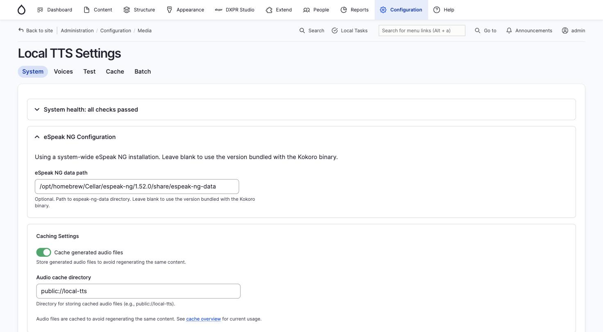
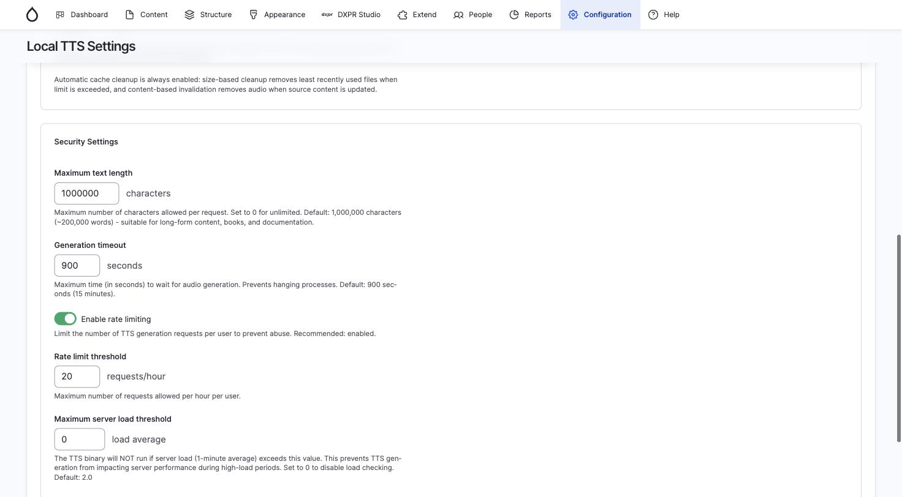
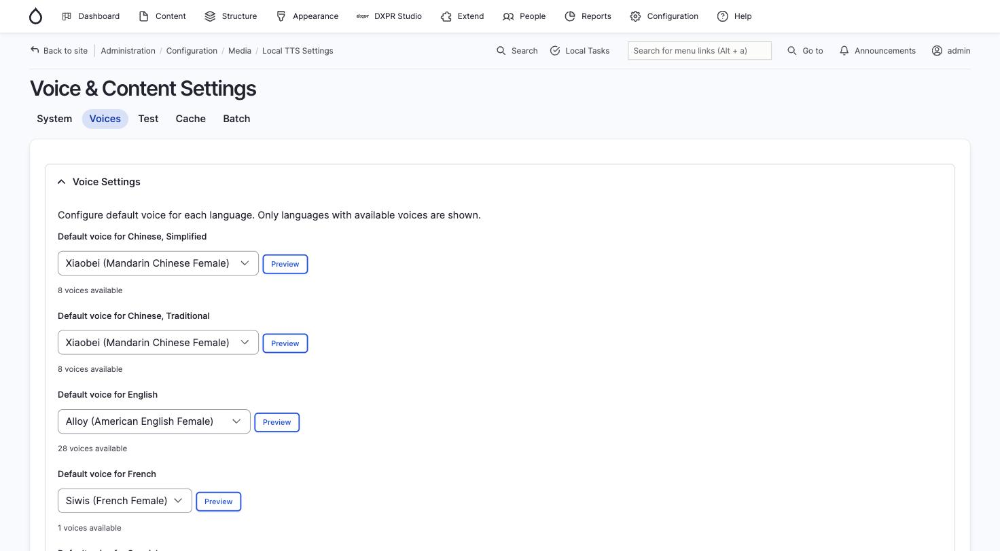
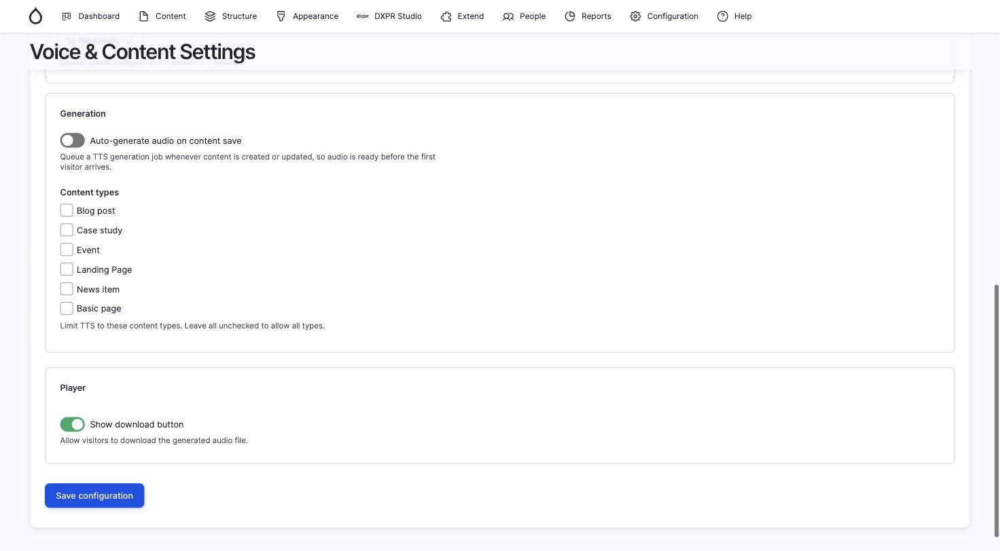

# Configuration

After enabling the module, visit **Administration > Configuration >
Media > Local TTS Settings** (`/admin/config/media/local-tts`) to
configure the module. The settings are split across two tabs: **System**
and **Voices**.

## System tab

The System tab (`/admin/config/media/local-tts`) contains system health,
eSpeak configuration, caching, and security settings.



### System health

A collapsible health check panel at the top verifies that the koko
binary, ffmpeg, and eSpeak NG are installed and working. Expand it to
see the status of each component.

### eSpeak NG configuration

Set the path to the `espeak-ng-data` directory on your server. Common
locations:

- **macOS (Homebrew)**:
  `/opt/homebrew/Cellar/espeak-ng/[version]/share/espeak-ng-data`
- **Linux**: `/usr/share/espeak-ng-data`

Leave blank to use the version bundled with the Kokoro binary.

### Caching settings

- **Cache generated audio files**: enable or disable file-based caching
  of generated audio
- **Audio cache directory**: defaults to `public://local-tts/`

### Cache management

- **Maximum cache size (MB)**: limit on disk space used by cached files
  (default: 1024 MB). Least recently used files are automatically
  deleted when this limit is exceeded.



### Security settings

- **Maximum text length**: caps the number of characters that can be
  converted in a single request (default: 1,000,000)
- **Generation timeout**: maximum time in seconds for a single
  generation (default: 900 seconds / 15 minutes)
- **Enable rate limiting**: limits the number of generation requests per
  user per hour (recommended: enabled)
- **Rate limit threshold**: maximum generation requests allowed per hour
  per user (default: 20)
- **Maximum server load threshold**: pauses generation when server load
  exceeds this value; set to 0 to disable (default: 0)

## Voice settings

The Voices tab (`/admin/config/media/local-tts/voices`) controls voice
selection, content generation, and player options.



### Default voice per language

Set the preferred voice for each language your site supports. Only
languages with available Kokoro voices are shown. Each dropdown lists
all voices for that language with a **Preview** button to hear a sample
sentence before committing.

### Default speech speed

Speed multiplier from 0.5x (slow) to 2.0x (fast). The default is 1x.

### Generation settings



- **Auto-generate audio on content save**: when enabled, a TTS
  generation job is queued automatically whenever content is created or
  updated, so audio is ready before the first visitor arrives
- **Content types**: limit TTS to specific content types (e.g. Blog
  post, Landing Page). Leave all unchecked to allow all types.

### Player settings

- **Show download button**: allow visitors to download the generated
  audio file

## Placing the player

### Block integration

For site-wide TTS on all content pages:

1. Go to **Structure > Block layout**
2. Place the **Local Text-to-Speech** block in a region (e.g. Content)
3. Configure which fields to include and voice/speed controls

### Field integration

For per-content-type control with Layout Builder support:

1. Go to **Structure > Content types > [Type] > Manage fields**
2. Add a field of type **Local TTS Player**
3. Position the field in **Manage display**
4. Configure voice/speed controls and field selection in the formatter
   settings

## Permissions

Two permissions control access:

- **Administer Local TTS settings**: access the configuration forms
- **Generate local text-to-speech audio**: required for visitors to use
  the TTS player; grant this to the Anonymous role for public use

## Queue processing

Audio generation runs in the background via Drupal's Queue API. When a
visitor requests audio for uncached content, the module queues the job
and returns a polling URL. The JavaScript player checks this URL every
3 seconds until the audio is ready.

Queue items are processed during cron runs. To ensure timely audio
delivery, configure cron to run frequently (every 1 to 2 minutes) or
use a dedicated queue runner:

```bash
# Process the TTS queue directly
drush queue:run local_tts_generate
```

## Playback progress

The player saves playback position to `localStorage` every 5 seconds.
When a visitor returns to the same page, the player offers to resume
from the saved position. Progress is cleared when playback reaches the
end.
