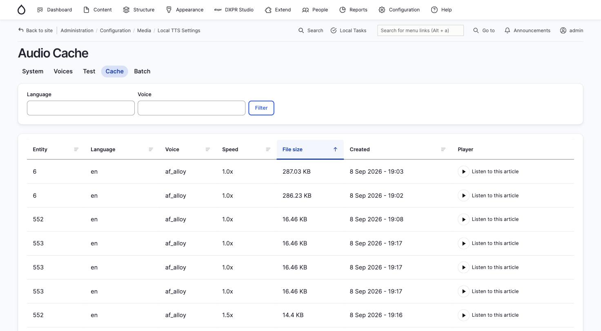
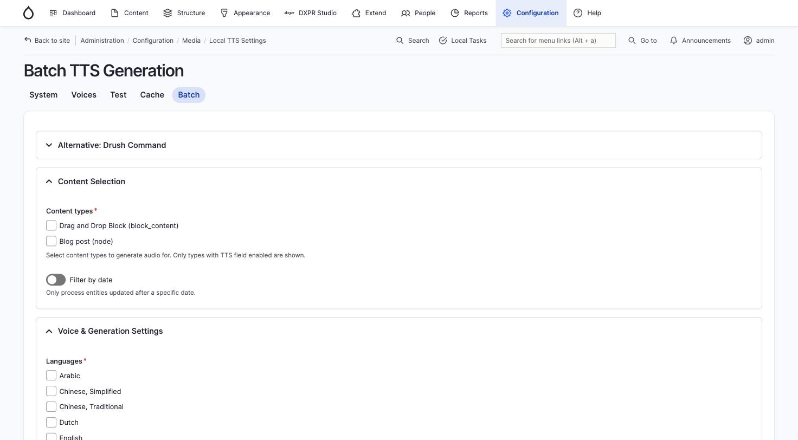

# Cache and Batch Generation

## Audio cache

Every generated audio file is stored on disk and tracked in a database
table. The cache key is an MD5 hash of the text content, voice ID,
speed, and language code, so any change to these inputs produces a new
file.

### Browsing the cache

Visit **Configuration > Media > Local TTS > Cache**
(`/admin/config/media/local-tts/cache`) to see all cached audio files.



The table shows:

| Column | Description |
|--------|-------------|
| Entity | The source entity ID |
| Language | Language code of the audio |
| Voice | Kokoro voice used |
| Speed | Playback speed multiplier |
| File size | Size of the OGG file on disk |
| Created | When the audio was generated |
| Player | Inline player to listen directly |

Use the **Language** and **Voice** filters to narrow the list. Click
column headers to sort.

### How invalidation works

Audio is automatically invalidated when:

- **Content is edited**: the module compares text fields between the
  current and previous entity versions. If text changed or the entity's
  public visibility changed, the old audio is deleted and (if
  auto-generate is enabled) a new generation job is queued.
- **A translation is deleted**: audio for that specific translation is
  removed.
- **An entity is deleted**: all audio for that entity is removed.

### Automatic cleanup

Three cleanup mechanisms run during cron:

1. **Stale metadata**: removes database records for entities that no
   longer exist
2. **Size-based eviction**: when the cache exceeds the configured
   maximum size, least recently accessed files are deleted first
3. **Orphan file cleanup**: audio files on disk with no matching
   database record are deleted (runs at most every 6 hours, processes
   up to 500 files per run, with a 1-hour grace period for in-progress
   generation)

### Manual cache management

```bash
# Clear all cached audio files and database records
drush local-tts:cache-clear
```

## Batch generation

Generate audio for multiple entities at once, either through the admin
UI or via Drush.

### Admin UI

Visit **Configuration > Media > Local TTS > Batch**
(`/admin/config/media/local-tts/batch`).



1. **Content types**: select which content types to process (only types
   with a TTS field enabled are shown)
2. **Filter by date**: optionally process only entities updated after a
   specific date
3. **Languages**: select which languages to generate audio for
4. **Voice and speed**: choose voice and speed settings for the batch
5. Click **Generate** to start processing

The batch runs via Drupal's Batch API with a progress bar. It includes
retry logic with exponential backoff for transient failures and database
keepalive for long-running batches.

### Drush batch command

```bash
# Generate audio for 10 English articles
drush local-tts:batch --entity-type=node \
  --bundle=article --language=en --limit=10

# Multiple languages
drush local-tts:batch --entity-type=node \
  --bundle=page --language=en,es,fr

# Force regeneration of existing cached files
drush local-tts:batch --entity-type=node \
  --bundle=article --force

# Only process entities updated since a specific date
drush local-tts:batch --entity-type=node \
  --bundle=article --updated-after=2026-01-01

# Preview how many entities would be processed
drush local-tts:batch --entity-type=node \
  --bundle=article --dry-run
```

See [Drush Commands](drush.md) for the full option reference.
