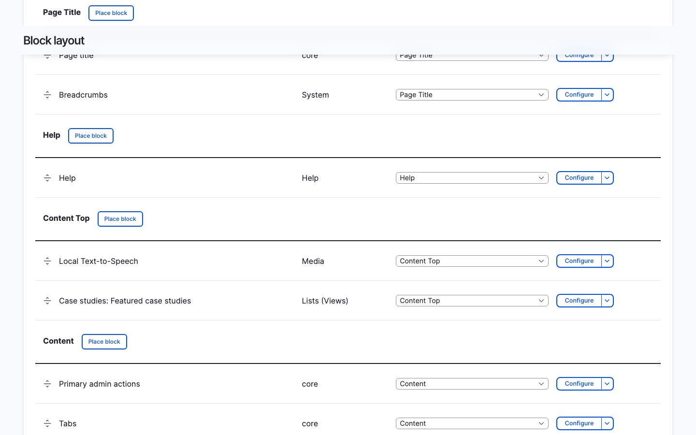

# Block Integration

Place a TTS player site-wide using Drupal's block system. The block
auto-detects the current page's entity, so it works on any content page
without extra configuration.

## Add the block

1. Go to **Structure > Block layout**
   (`/admin/structure/block`)
2. Find the region where you want the player (e.g. Content) and click
   **Place block**
3. Search for **Local Text-to-Speech** and click **Place block**
4. Optionally restrict visibility by content type, role, or page
5. Click **Save block**

<video autoplay loop muted playsinline>
  <source src="../videos/block-placement.mp4" type="video/mp4">
</video>

## Configure the block

The block settings include:

- **Title**: defaults to hidden; set a visible title if you want one
- **Title display**: show or hide the block title
- **Visibility settings**: standard Drupal block visibility (pages,
  content types, roles)

Voice, speed, and volume settings come from the site-wide defaults on
the [Voices tab](../setting-up/configuration.md#voice-settings).

## How it works

The block plugin (`LocalTtsBlock`) calls the shared `TtsPlayerBuilder`
service to render the player. On each page load, it detects the
current route's entity (node, taxonomy term, or any fieldable entity)
and passes it to the player. If no entity is found on the current
route, the block is hidden.

## When to use this method

- You want every content page on the site to have a player
- You do not need different voice/speed settings per content type
- You want the simplest setup with minimal configuration

## Limitations

- Voice and speed settings are site-wide, not per content type
- The block only detects entities on their canonical route (e.g.
  `/node/123`); it does not render on custom controller routes unless
  the route has an entity parameter
- For per-bundle control, use the [entity field](field.md) or
  [extra field](extra-field.md) instead
