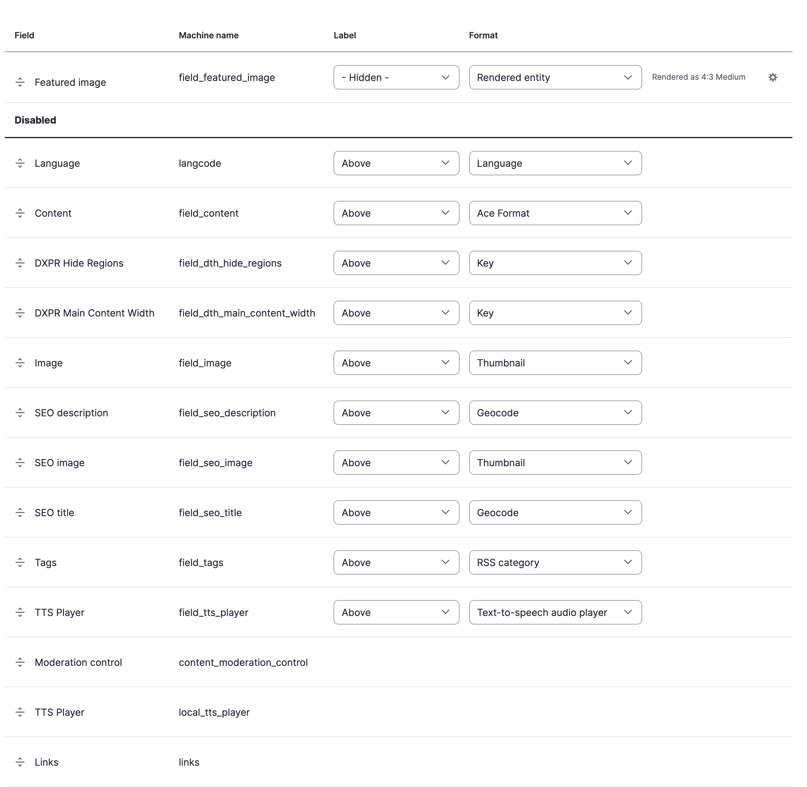

# Extra Field Integration

The extra field (also called a pseudo-field) provides a TTS player
without adding a real field to the database. It appears in **Manage
Display** for every fieldable entity type and can be toggled on or off
per display mode.

<video autoplay loop muted playsinline>
  <source src="../../videos/extra-field-setup.mp4" type="video/mp4">
</video>

## Enable the extra field

1. Go to **Structure > Content types > [Your type] > Manage display**
   (`/admin/structure/types/manage/[type]/display`)
2. Find **TTS Player** in the field list (it appears automatically
   for all content types)
3. Drag it from the **Disabled** section to the desired position
4. Click **Save**

## Configuration

The extra field uses the site-wide voice and speed defaults from the
[Voices tab](../setting-up/configuration.md#voice-settings). There
are no per-field formatter settings; to override voice or speed per
content type, use the [entity field](field.md) instead.

## How it differs from the entity field

| | Extra field | Entity field |
|---|---|---|
| Database storage | None | Field storage created |
| Per-bundle voice/speed | No (uses site defaults) | Yes (formatter settings) |
| Available on | All entity types automatically | Added per content type |
| Setup | Toggle in Manage Display | Add field, then configure |

## When to use this method

- You want TTS on specific content types without adding a real field
- Site-wide voice/speed defaults are sufficient
- You want the player on entity types beyond nodes (taxonomy terms,
  media, custom entities)
- You want a quick setup: no field creation, just toggle in Manage
  Display

## Limitations

- No per-content-type voice or speed overrides
- No per-display-mode formatter settings beyond position and visibility
