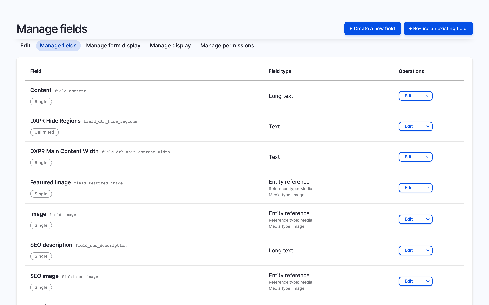

# Entity Field Integration

Add a dedicated TTS player field to specific content types. This gives
you per-bundle control over which content types have TTS, and lets you
configure voice, speed, and volume per display mode via the field
formatter.

<video autoplay loop muted playsinline>
  <source src="../../videos/field-setup.mp4" type="video/mp4">
</video>

## Add the field

1. Go to **Structure > Content types > [Your type] > Manage fields**
   (`/admin/structure/types/manage/[type]/fields`)
2. Click **Create a new field**
3. Select **Local TTS Player** as the field type
4. Give it a label (e.g. "Audio player") and click **Save**

## Position the field

1. Go to **Manage display** for the same content type
   (`/admin/structure/types/manage/[type]/display`)
2. Drag the TTS player field to the desired position
3. Click the gear icon to configure the formatter settings

## Formatter settings

The field formatter (`LocalTtsPlayerFormatter`) exposes these options
per display mode:

| Setting | Description |
|---------|-------------|
| Voice | Override the site-wide default voice for this content type |
| Speed | Override the default speech speed |
| Volume | Set initial volume (0.0 to 1.0) |
| Fields | Select which fields to include in the audio extraction |

Leave Voice and Speed blank to inherit the site-wide defaults from the
[Voices tab](../setting-up/configuration.md#voice-settings).

## Layout Builder

The field works with Layout Builder. After adding the field to the
content type, it appears as a block in Layout Builder's block picker.
Drag it to any region in your layout.

## When to use this method

- You need different voice or speed settings per content type
- You want TTS only on specific bundles (e.g. articles, not pages)
- You use Layout Builder and want to position the player precisely
- You need per-display-mode configuration (e.g. show on Full but
  hide on Teaser)

## Limitations

- Requires adding a field to each content type individually
- Field storage is created even though no data is stored per entity
  (the field type exists only to enable the formatter)
- For a lighter option without field storage, use the
  [extra field](extra-field.md)
